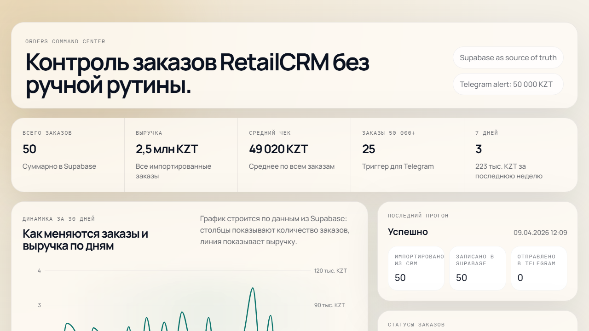
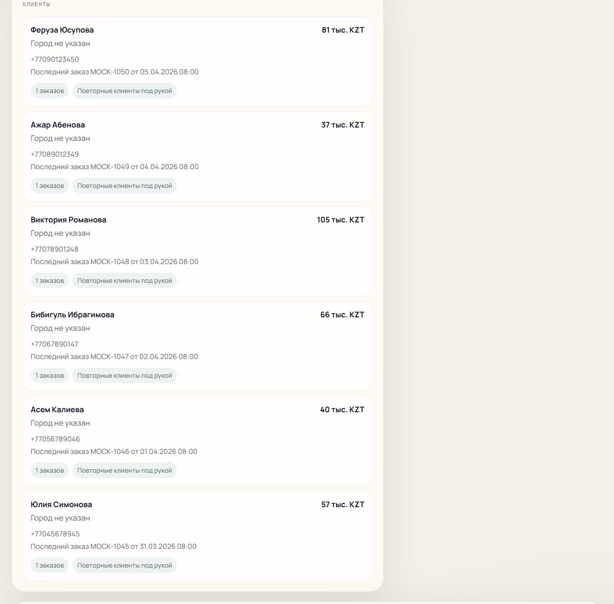
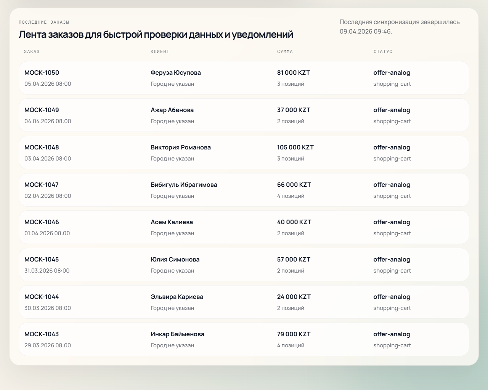
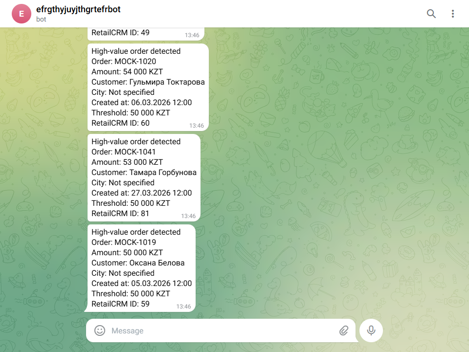

# Мини-дашборд заказов

Сделала тестовое задание для позиции `AI Tools Specialist` с использованием `Claude Code CLI`: загрузила `50` тестовых заказов из `mock_orders.json` в `RetailCRM`, написала синхронизацию `RetailCRM -> Supabase`, собрала дашборд на `Next.js` и настроила `Telegram`-уведомления для заказов выше `50 000 ₸`.

На главной странице дашборда есть график заказов и выручки, ключевые метрики, список клиентов и последние заказы.

## Ссылки

- Дашборд: `https://project-tgn4y.vercel.app`
- GitHub: `https://github.com/AlenaYashkina/testing`

## Что сделала

- загрузила в `RetailCRM` все `50` заказов из тестового файла через API
- написала скрипт синхронизации заказов из `RetailCRM` в `Supabase`
- сделала веб-дашборд с графиком заказов и выручки, клиентами и лентой последних заказов
- настроила `Telegram`-уведомления по заказам выше `50 000 ₸`
- добавила тесты на маппинг данных, агрегации и отображение списка заказов

## Скриншоты

### Дашборд

### Telegram-уведомление

## Какие промпты давала Claude Code

- `Собери Next.js проект для мини-дашборда заказов: RetailCRM -> Supabase -> Telegram.`
- `Сделай импорт mock_orders.json в RetailCRM без дублей при повторном запуске.`
- `Добавь синхронизацию заказов из RetailCRM в Supabase и страницу с графиком, клиентами и последними заказами.`
- `Покрой тестами маппинги, агрегации и таблицу заказов.`

## Где немного застряла и как решила

- В демо `RetailCRM` часть справочников отличалась, поэтому сделала импорт с мягким fallback, чтобы заказы не падали из-за необязательных полей.
- В `Supabase` сначала не было таблиц, поэтому вынесла схему в отдельный `supabase/schema.sql` и применила ее через `SQL Editor`.
- Для `Telegram` сначала нужен был правильный `chat_id`, поэтому получила его через `getUpdates` после сообщения боту.
